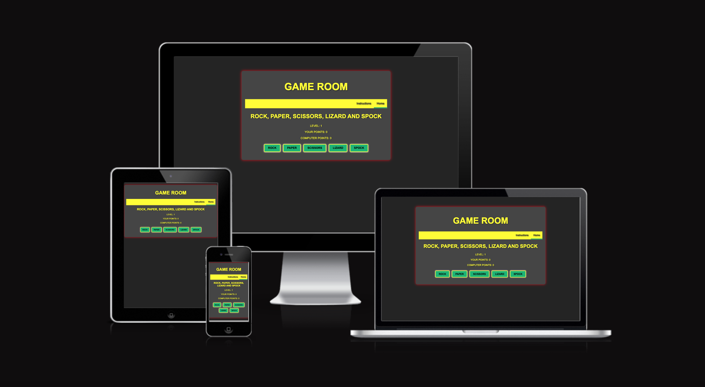
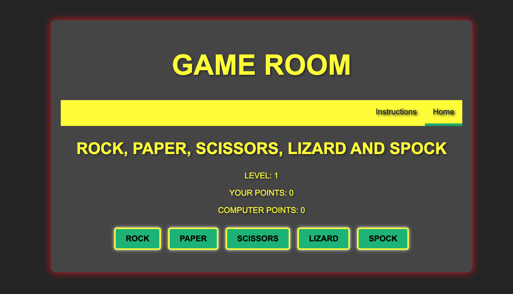
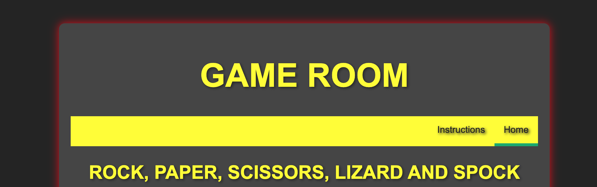
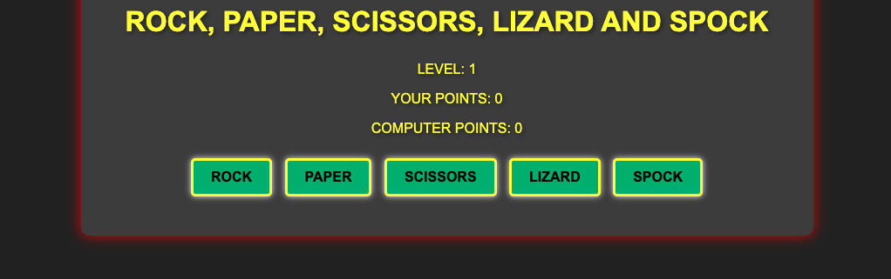
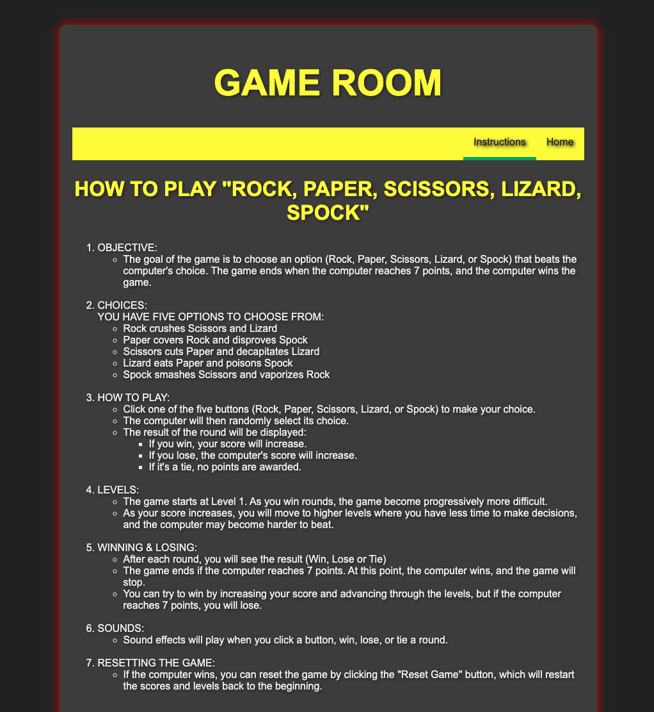
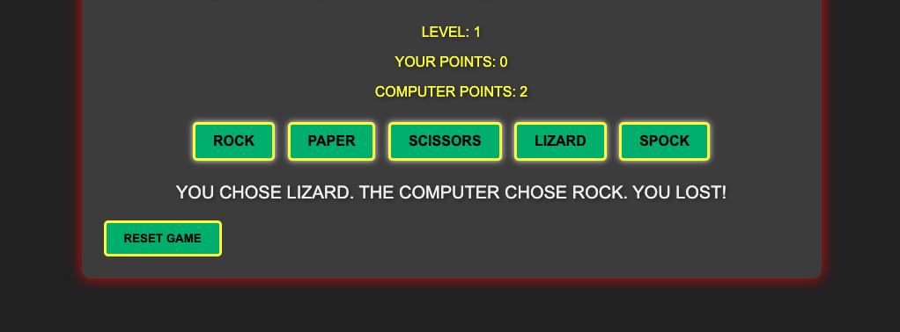
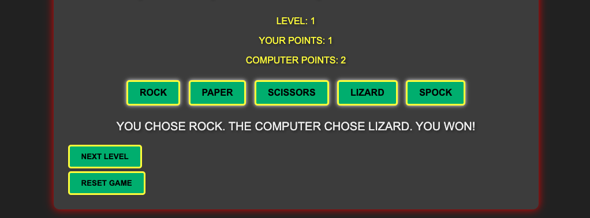
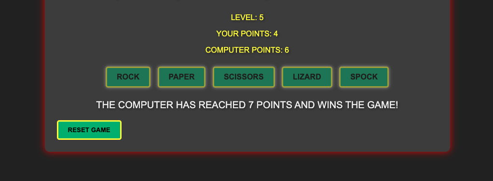
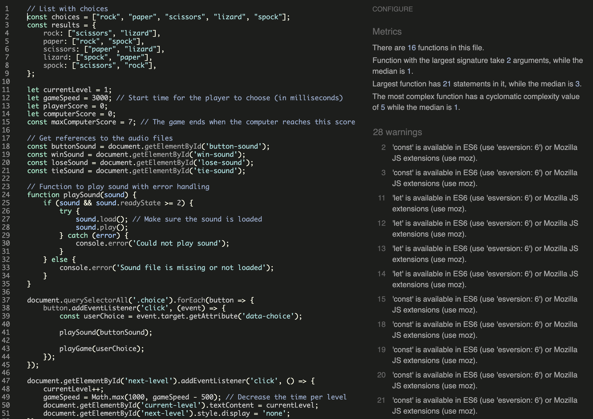
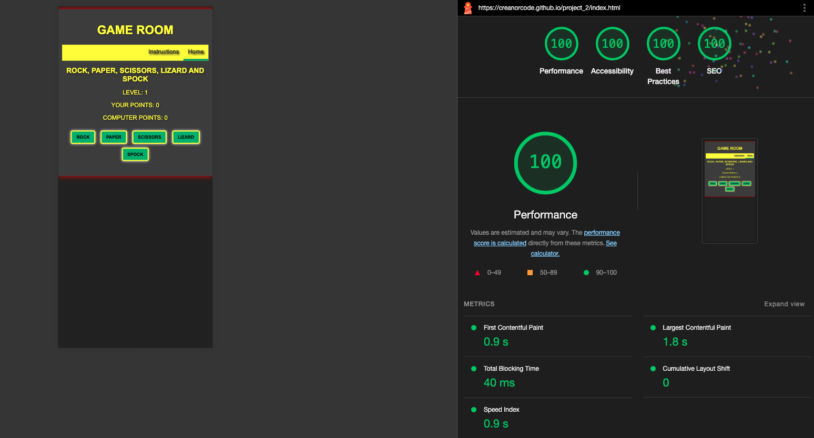

# Game Room - Rock, Paper, Scissor, Lizard and Spock game!

This is a Rock, Paper, Scissor, Lizard and Spock game. You are playing against the computer and if you level up it goes faster and the computer will be harder to beat. You are gathering points as you win. You are also able to reset the game to level 1 with no points.

## Features

This is the main game area. Here you can navigate to the instructions page (will cover it later down). The main title 'Game Room' is presented on all pages, also the navigation with the links 'Instructions' and 'Home' is also presented on all pages.

------

### Existing features

  - _Navigation bar_

    - This navigation bar i presented on all pages. Here the user easily can navigate across all devices to page 'Instruction' and back to 'Home', witch are the two links on the navigation. You can also se the title of the game just underneath the navigation.

------

  - _Scoreboard and play Buttons_

    - Under the navigation you have the scoreboard and the actual level you are playing on. There you also have the buttons you can chose from - rock, paper, scissor, lizard and spock.

------

  - _Instruction page_

    - On the instruction page there the user can read the instructions on how to play the game.

------

  - _How to play the game_

    - The user will chose a button and then the computer will chose. 
    - If the computer wins the computer will be given a point.
    - If the user wins the user is given a point.
    - If it is a tie no points will be given.
    - The user shall try to level up as many times as possible before the computer reaches 7 points. If the computer reaches 7 points the game is over.

-------

    - The user chose a button to click on, a sound effect will play then. Then the copmuter will chose and maby the computer wins and 1 point is given to the computer and you lose. This is how it appears. If you lose there will also be a sound effect. The user is now also able to reset the game to the beginning.

    - If it will be a tie, it means you chose the same, a sound effect will play and it will look like this. No points will be given when it is a tie.

    - If the user wins there will be a sound effect and 1 point will be given to the user. Now there is also a butten to level up. The user can decide to level up or not to level up. 

    - If the computer reaches 7 points the game is over and you have to reset to begin frpm level 1.

-------

## Features to Implement

  - To be able to play against a another human and not anly the computer. 
  - More sound effects, on the reset button and the next-level button. 
  - The possibilty to turn on background music wile the user are playing.
  - Different kind of levels with perks.

-------

## Technology

  - Html - for building the UI
  - CSS - for styling the UI
  - Javascript - for the gameplay and interaction.
  - GitHub - for the development of the game.
  - GitPages - for hosting the game.

## Testing

  - I have testes the this page works in different browsers like, Chrome, Firefox, Safari.
  - I have tested the page and confirmed the it is responsive. That the site looks over all good and all functions working att all standard screen sizes
    using devtool device tollbar.
  - I have confirmed that the different functions on the site is working as they should and was intended to work.

-------

## Validator testing

  - HTML
    - No error or warnings was returned when passing through the official [W3C validator](https://validator.w3.org/nu/?doc=https%3A%2F%2Fcreanorcode.github.io%2Fproject_2%2Findex.html).
  
  - CSS
    - No errors were found when passing through the official [(Jigsaw) validator](https://jigsaw.w3.org/css-validator/validator?uri=https%3A%2F%2Fcreanorcode.github.io%2Fproject_2%2Findex.html&profile=css3svg&usermedium=all&warning=1&vextwarning=&lang=sv).
  
  - Javascript
    - The code was put in [jshint.com](https://jshint.com/) with warnings but no errors.
    - In the screenshot below it is possible to review some of it 
      
  
  - Accessibility
    - I confirmed that the colors and fonts chosen are easy to read and accessible by running it through Lighthouse in devtools.

    

------

## Unfixed bugs

  - There is no unfixed bugs.

-------

## Deployment

  - The site was deployed to GitHub pages. The steps are as follows:
    - In the Github repository, go to settings.
    - Click on Pages-link on the menu to the left.
    - From the source section drop down list, select the main branch and save.
    - Then I got a link to my page on Github.

  - Here is the live link to the site - [Game Room - Rock, Paper, Scissor, Lizard and Spock game!](https://creanorcode.github.io/project_2/index.html)

## Credits

  - Sound effect was downloaded for free from [www.mixkit.co](https://mixkit.co/)
  - The favicon was mabe in [Canva](https://www.canva.com/)

